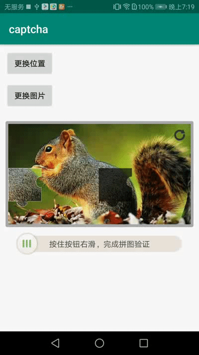
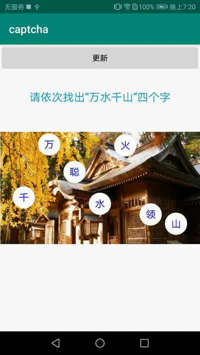
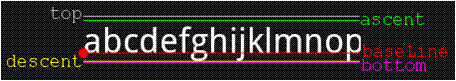

# 滑动拼图验证和点击文字验证  
## 效果图    
|滑动拼图验证 |点击文本验证  
|---|---|  
||

## 特点
**滑动拼图验证**
+ 自动切图，只需完整图片(支持Bitmap,资源id,Drawable,网络图片)  
+ 可自定义拖动样式  
+ 可自定义滑块形状  
+ 可自定义滑块阴影  
+ 可自定义缺口样式  
+ 可自定义拖动条文字及颜色  
+ 可自定义背景图  
+ 可自定义背景图和拼图距离  
+ 可自定义seekBar前后左右距离  

**点击文字验证**
+ 文字横向平均分布，纵向随机分布  
+ 可自定义文字  
+ 可自定义正常和选中文字绘制笔  
+ 可自定义绘制正常和选中的文字背景  
+ 需提供每块文字的宽高

## 滑动拼图验证  
**使用方式**  
  
将SlidePuzzleCaptchaView引入到布局文件中  
```
  <com.heng.captcha.puzzle.SlidePuzzleCaptchaView
            android:id="@+id/slide_captcha"
            android:layout_width="match_parent"
            android:layout_height="wrap_content"
            android:layout_marginLeft="10dp"
            android:layout_marginRight="10dp"
            app:puzzleBackground="@drawable/bg_captcha_view"
            app:dragTipText="按住按钮右滑，完成拼图验证"
            app:dragTipTextColor="#444444"
            app:puzzleCoverLayout="@layout/layout_cover_captcha"
            app:puzzlePadding="5dp"
            app:puzzleRatio="16:9"
    />
```  
使用SlidePuzzleCaptchaHelper辅助类     
```
 SlidePuzzleCaptchaHelper.create(slideCaptchaView).setPuzzleDrawable(R.drawable.demo1)
            .setCaptchaStrategy(DefaultCaptchaStrategy(this))
            .matchedCallBack { matchedDegree, durcation ->  }
```  

SlidePuzzleCaptchaHelper 方法介绍  

|方法名|描述  
|---|---|  
|fun create(slideCaptchaView: SlidePuzzleCaptchaView): SlidePuzzleCaptchaHelper| SlidePuzzleCaptchaHelper静态构建方法  
|setPuzzleDrawable(@DrawableRes resId: Int)| 设置拼图图片资源  
|setPuzzleDrawable(drawable: Drawable)| 设置拼图Drawable  
|setPuzzleBitmap(bitmap: Bitmap)| 设置拼图图片的bitmap  
|setPuzzleNetWorkImage(url: String)| 设置网络图片  
|resetSeekBar()| 重置SeekBar，建议失败后调用  
|resetPuzzle()| 重置拼图，建议刷新时调用   
|matchedCallBack(matchedCallBack: (matchedDegree: Float,duration:Long) -> Unit)| 匹配结束后回调 matchedDegree 0表示完全匹配 duration匹配时长  
|getCoverView(): View| 获取覆盖层的View，对应自定义属性puzzleCoverLayout的layout  
|setCaptchaStrategy(captchaStrategy: PuzzleCaptchaStrategy)|设置验证策略   
  
PuzzleCaptchaStrategy拼图绘制策略类，支持自定义，默认提供DefaultCaptchaStrategy  
PuzzleCaptchaStrategy 方法说明  

|方法名|描述  
|---|---|  
|getBlockPath(): Path| 获取滑块绘制Path  
|drawBlockShadow(canvas: Canvas,path: Path)| 设置滑块阴影  
|drawGap(canvas: Canvas,path: Path)| 绘制缺口内容  
|getGapPosition(xMin: Float,xMax: Float,yMin: Float,yMax: Float): Pair<Float, Float>| 获取缺口的坐标值,参数分别是坐标范围   first 宽 second 高 
  

自定义属性  
   
|属性名|描述  
|---|---|  
|puzzleCoverLayout| 拼图浮层，可用于添加刷新按钮或者完成高亮动画等
|dragTipText| 拖动条文字描述  
|dragTipTextColor| 拖动条描述文字颜色  
|puzzleRatio| 拼图宽高比   
|puzzleBackground| 拼图背景   
|puzzlePadding| 拼图背景和拼图之间距离   
|puzzlePaddingLeft| 拼图背景和拼图左侧距离
|puzzlePaddingTop| 拼图背景和拼图上方距离
|puzzlePaddingRight| 拼图背景和拼图右侧距离
|puzzlePaddingBottom| 拼图背景和拼图下方距离
|seekBarThumbOffset| seekBar偏移量   
|seekBarProgressDrawable| seekBar进度条样式  
|seekBarThumb| seekBar的滑动块样式  
|seekBarHeight| seekBar高度  
|seekBarMinHeight| seekBar最小高度  
|seekBarMarginLeft| seekBar距离左侧距离  
|seekBarMarginTop| seekBar距离上方距离  
|seekBarMarginRight| seekBar距离右侧距离  
|seekBarMarginBottom| seekBar距离下方距离  
|seekBarMargin| seekBar距离周围距离  


## 点击文字验证  
TextCaptchaView继承自ImageView，支持ImageView的所有属性，在布局文件中引用  
```
    <com.heng.captcha.text.TextCaptchaView
            android:id="@+id/text_captcha"
            android:background="@drawable/demo4"
            android:layout_width="match_parent"
            android:layout_height="0dp"
            app:layout_constraintLeft_toLeftOf="parent"
            app:layout_constraintRight_toRightOf="parent"
            app:layout_constraintBottom_toBottomOf="parent"
            app:layout_constraintTop_toTopOf="parent"
            app:layout_constraintDimensionRatio="16:9"/>
```  
设置文本，设置监听  
```
     textCaptchaView.setText("万水千山","千万聪水火领山")
        textCaptchaView.verifyCallBack = { isSuccess ->
            Toast.makeText(this, if (isSuccess) "验证成功" else "验证失败", Toast.LENGTH_SHORT).show()
        }
        findViewById<View>(R.id.refresh).setOnClickListener {
            textCaptchaView.refresh()
        }
```  
textCaptchaView主要方法/属性  

|方法/属性|描述  
|---|---|  
|refresh()| 刷新文字位置
|setText(targetText: String, allText: String)| 设置目标文字和全部文字  
|setCaptchaStrategy(captchaStrategy: TextCaptchaStrategy)| 设置文字绘制策略  
| verifyCallBack: ((isSuccess: Boolean) -> Unit)| 设置验证回调     

TextCaptchaStrategy自定义文字的绘制样式 默认提供DefaultTextCaptchaStrategy  
TextCaptchaStrategy方法说明  

|方法名|描述  
|---|---|  
|getTextPaint(): Paint| 获取绘制正常文字的paint
|getSelectedTextPaint(): Paint| 获取绘制选中文字的paint  
|drawBackGround(canvas: Canvas, centerX: Float, centerY: Float)| 绘制正常文字背景，centerX,centerY是文字的中心点 
|drawSelectedBackGround(canvas: Canvas, centerX: Float, centerY: Float)|  绘制选中文字背景，centerX,centerY是文字的中心点 
|getEachWidthAndHeight(): Pair<Int, Int>|  获取每块文字的宽高 first 宽 second 高
### 依赖方式
在根项目的build.gradle增加以下配置
```
allprojects {
    repositories {
        maven { url "https://jitpack.io" }
    }
}
```
在对应模块下的build.gradle中增加以下配置
```
apply plugin: 'kotlin-android'
apply plugin: 'kotlin-kapt'

dependencies {
        implementation 'com.github.Jiaoshichun:Captcha:1.0.0'
    }
```
## Other  
+ **文字绘制的起始位置是baseLine**  
  
paint的FontMetrics属性  
  
  
TextCaptchaView计算文字中心，在Y轴是通过 (FontMetrics.descent-FontMetrics.ascent)/2  

+ **canvas.clipPath方法裁剪的是画布，先剪切画布，再画bitmap,才能实现剪切效果**  
+ **必须设置drawable.setBounds(0, 0, width, height)后再画drawable，才能保证剪切时控件和drawable大小相同，最后需要恢复drawable的bound,否则可能会出现图片显示小的问题**
```
       val tempBitmap = Bitmap.createBitmap(width, height, ARGB_8888)
       val clipCanvas = Canvas(tempBitmap!!)
       val bounds = drawable.copyBounds()
       drawable.setBounds(0, 0, width, height)
       clipCanvas.clipPath(blockPath)
       drawable.draw(clipCanvas)
       drawable.setBounds(bounds.left, bounds.top, bounds.right, bounds.bottom)
```  

